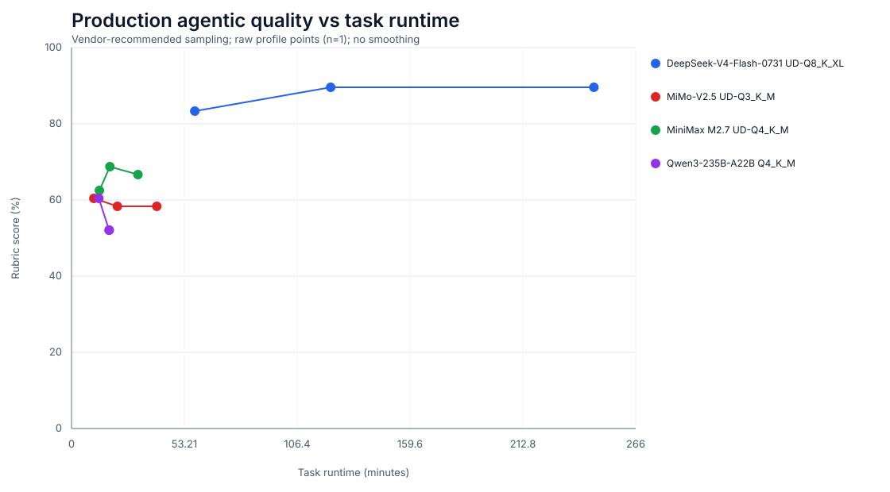
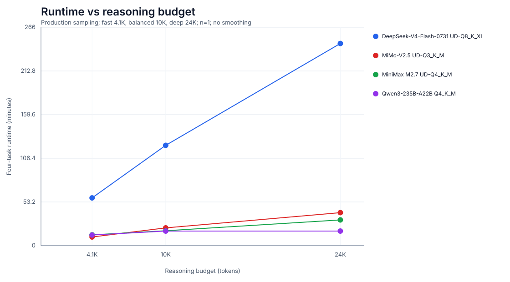
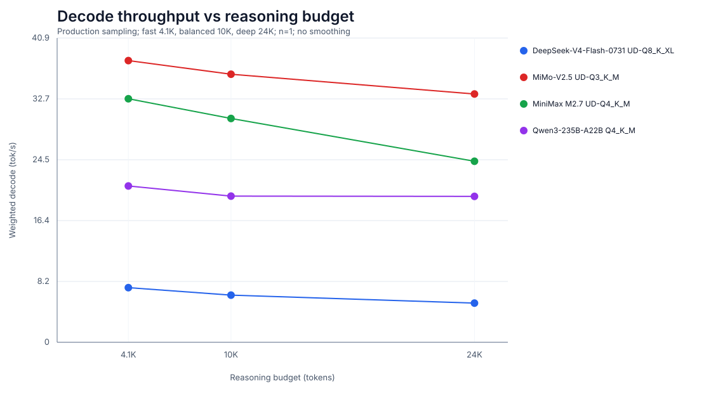

# Mac Studio local LLM benchmarks

Production-shaped local inference measurements from an Apple M2 Ultra Mac Studio
with 192 GB unified memory. Every point is backed by a committed metrics artifact;
full prompts, reasoning, answers, and API timing records live in revision-pinned
GitHub Gists referenced by that artifact.

## Production profile curves







All 12 production-profile runs use vendor-recommended sampling, the same four
tasks, and reasoning ceilings of 4,096, 10,000, and 24,000 tokens. Every point is
one raw run (`n=1`) with no smoothing.

| Model | Fast runtime | Balanced runtime | Deep runtime | Fast decode | Balanced decode | Deep decode |
|---|---:|---:|---:|---:|---:|---:|
| DeepSeek-V4-Flash-0731 Q8 | 58.1 min | 122.2 min | 246.3 min | 7.34 tok/s | 6.34 tok/s | 5.27 tok/s |
| MiMo-V2.5 Q3 | **10.5 min** | 21.6 min | 40.2 min | **37.87 tok/s** | **36.03 tok/s** | **33.37 tok/s** |
| MiniMax M2.7 Q4 | 13.2 min | 18.1 min | 31.3 min | 32.74 tok/s | 30.09 tok/s | 24.33 tok/s |
| Qwen3-235B-A22B Q4 | 12.9 min | **17.7 min** | **17.8 min** | 21.01 tok/s | 19.65 tok/s | 19.61 tok/s |

| Model | Fast quality | Balanced quality | Deep quality |
|---|---:|---:|---:|
| DeepSeek-V4-Flash-0731 Q8 | 40/48 | **43/48** | **43/48** |
| MiMo-V2.5 Q3 | 29/48 | 28/48 | 28/48 |
| MiniMax M2.7 Q4 | 30/48 | 33/48 | 32/48 |
| Qwen3-235B-A22B Q4 | 29/48 | 25/48 | 25/48 |

DeepSeek is the clear quality winner and the clear speed loser. MiniMax is the
best non-DeepSeek quality/speed compromise; MiMo is fastest but scores lower.
Qwen is the quality loser in this suite: balanced and deep produced identical
answers despite the larger ceiling. MiniMax also repeated three of four answers
across all profiles, so its score movement comes only from the concurrency task.

More reasoning budget did not reliably improve this single-run matrix. DeepSeek
improved from fast to balanced, then plateaued; other models were flat or worse.
Models generated different token counts, and reasoning budget is a ceiling rather
than a quota. Scores come from one blind rubric review per answer (`n=1`), so these
points rank these traces rather than estimate confidence intervals.

## Data contract

One benchmark profile produces two small committed records:

- `results/runs/<run-id>.json`: immutable machine metrics and provenance.
- `results/scores/<run-id>.json`: human rubric scores, joined by `run_id`.

Run metrics contain:

- resolved model, server, sampler, and reasoning-profile configuration;
- source revision, quantization, every GGUF shard size and SHA-256;
- host hardware/OS, runner commit/dirty state, and llama.cpp version;
- task-suite hash, timestamps, success/finish state, tokens, cache use, wall time,
  prefill/decode timings, weighted throughput, and observed server RSS;
- full-trace SHA-256 plus Gist ID, revision, and immutable revision URL;
- provenance for the model, runner, configuration, and trace.

This makes charts disposable views. Adding a model means adding its config and new
run artifacts; existing models do not rerun. `scripts/render_chart.py` renders
quality against task runtime plus production-profile runtime and decode curves,
all with raw points and no smoothing. Other charts can consume the same JSON.

## Model configs

Each model owns its production settings under [`configs/models`](configs/models):

| Model | Sampling |
|---|---|
| DeepSeek-V4-Flash | `temperature=1.0`, `top_p=1.0` |
| MiMo-V2.5 | `temperature=1.0`, `top_p=0.95` |
| MiniMax M2.7 | `temperature=1.0`, `top_p=0.95`, `top_k=40` |
| Qwen3-235B-A22B thinking | `temperature=0.6`, `top_p=0.95`, `top_k=20`, `min_p=0` |

Each config also declares `fast`, `balanced`, and `deep` reasoning profiles. The
profile is part of every metrics artifact, so chart curves can compare real
operating points rather than repeated identical requests.

## Cache switching

`scripts/cache_switch.py` adds two artifact-first curves without mixing their
semantics:

- production RAM prompt-cache TTFT at 1, 2, 4, and 8 active 16K-token
  conversations;
- explicit disk-slot restore and end-to-end TTFT at 8K, 16K, 32K, and 49K
  prompt tokens.

llama.cpp does not automatically spill `--cache-ram` entries to disk. RAM-cache
eviction falls back to prompt recomputation; `/slots/{id}?action=restore` is a
separate explicit persistence path. Results therefore remain separate under
`results/cache-switch/`. Every point contains raw per-conversation measurements,
the resolved production model/server config, serialized slot bytes, model and
host identity, effective cached-token fraction, and a revision-pinned Gist
trace. A successful restore response is not counted as cache reuse: current
llama.cpp builds can reprocess the full prompt for SWA or hybrid-memory models.

Validate the 32-point matrix without loading weights:

```bash
uv run --script scripts/cache_switch.py configs/models/*.yaml --dry-run
```

Run it:

```bash
uv run --script scripts/cache_switch.py configs/models/*.yaml
```

## Run

Set llama.cpp and model paths on the Mac Studio:

```bash
export LLAMA_SERVER=/path/to/llama-server
export DEEPSEEK_V4_MODEL=/path/to/DeepSeek-V4-Flash-0731-UD-Q8_K_XL-00001-of-00005.gguf
export MIMO_MODEL=/path/to/MiMo-V2.5-UD-Q3_K_M-00001-of-N.gguf
export MINIMAX_MODEL=/path/to/MiniMax-M2.7-UD-Q4_K_M-00001-of-N.gguf
export QWEN3_MODEL=/path/to/Qwen3-235B-A22B-Q4_K_M-00001-of-N.gguf
```

Validate the full matrix without loading weights:

```bash
uv run --script scripts/benchmark.py configs/models/*.yaml --dry-run
```

Run one profile for every model:

```bash
uv run --script scripts/benchmark.py \
  configs/models/*.yaml \
  --profiles balanced
```

The runner hashes weights, runs all four tasks, publishes one public Gist per
model/profile, then writes `results/runs/<run-id>.json`. If Gist publication
fails, recoverable trace and draft metrics remain under `.benchmark-work/`; no
incomplete metrics file is added to `results/runs/`.

Production runs refuse uncommitted changes under `scripts/` or `configs/` so the
recorded runner commit identifies executable code. `--allow-dirty` exists only
for development.

`--no-publish-gists` exists for local development only. Do not commit those run
artifacts because they lack immutable trace pointers.

## Score and render

Each local run directory contains `score-template.json`. Score the delivered
answers, add `reviewer` and `scored_at`, replace each null criterion with 0–2,
include each task's `score` and `maximum`, then commit it as
`results/scores/<run-id>.json`.

Regenerate charts:

```bash
uv run --script scripts/render_chart.py
```

Validate configs, schemas, Gist joins, and chart rendering:

```bash
uv run --with 'pydantic>=2.12,<3' --with 'pyyaml>=6,<7' \
  python -m unittest discover -s tests
```
